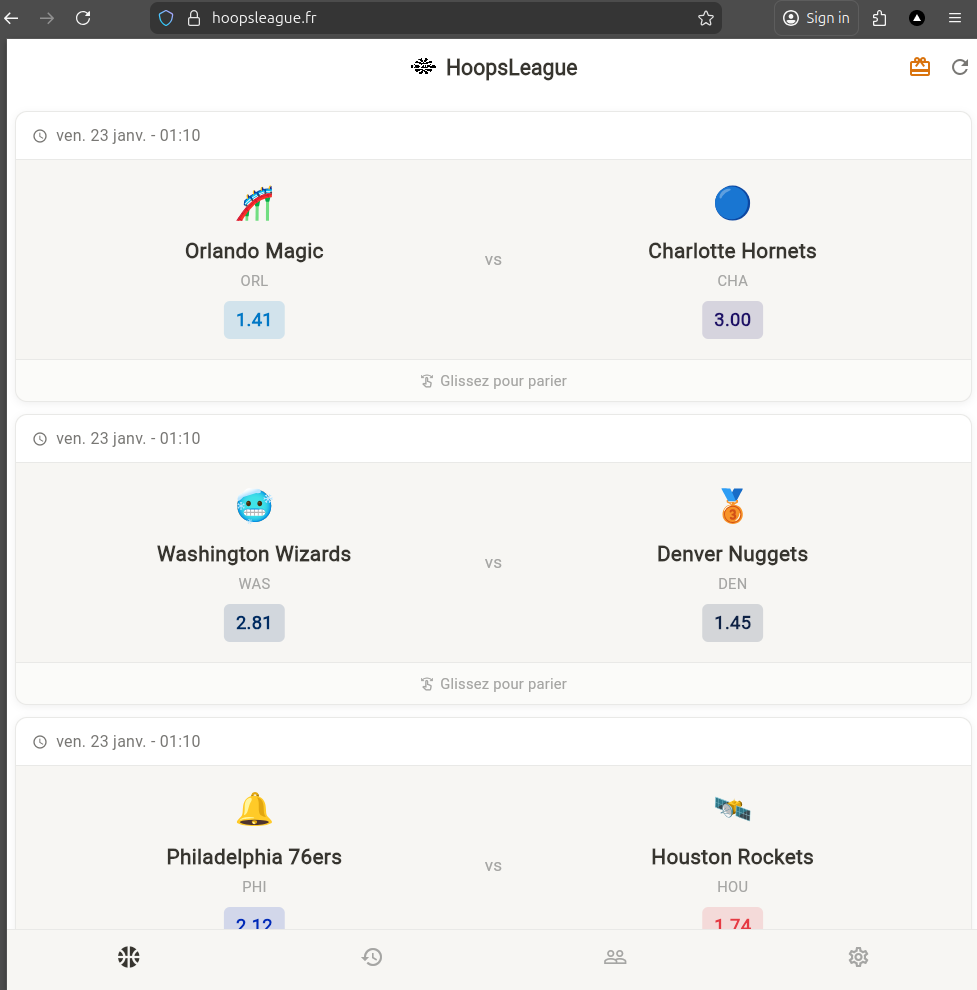

# HoopsLeague

> **Try it live:** [hoopsleague.fr](https://hoopsleague.fr)

A mobile NBA betting application built with Flutter. Users can create accounts, receive daily points, and place bets on upcoming games.

<p align="center">
  
</p>

## Features

- **User Authentication** - Sign up, sign in, and account management via Supabase
- **Points System** - Starting balance and daily bonus points for betting
- **Live Games** - View upcoming NBA games with real-time odds
- **Betting** - Place single or parlay bets on your favorite teams
- **Bet History** - Track past bets with win/loss indicators
- **Leaderboard** - Rankings based on point balance
- **Leagues** - Create or join private leagues with friends
- **Multi-language** - French and English support
- **Odds Formats** - European, American, and British odds display
- **Dashboard** - Personal stats with points history graph

## Tech Stack

| Layer | Technology |
|-------|-----------|
| Frontend | Flutter 3.9.2+ |
| Backend | Python server + Supabase |
| ML Model | scikit-learn (calculates odds) |
| Hosting | Vercel |
| Email Service | SMTP server for Supabase notifications | Improvmx | Resend 

### Backend Overview

https://github.com/FabienGaut/Backend_hoopsleague

The backend is built in Python and runs on a server that:

- Collects data from multiple APIs and pushes it to Supabase
- Computes game odds using a machine learning model built with [scikit-learn](#link-to-backend-readme)
- Ensures database health through automated scripts
- Runs all processes on a schedule using `crontab`
- Handles email notifications via an SMTP server

The Flutter app fetches all data directly from Supabase, keeping the entire system fully automated.

## Requirements

- Flutter SDK 3.9.2+
- Dart 3.9.2+
- Python 3.11+ (for backend, see backend README for details)

## Setup

1. Clone the repository:
```bash
git clone https://github.com/your-username/hoopsleague.git
cd hoopsleague
```
2. Install the dependencies
```bash
flutter pub get
```

3. Create the environment files
```bash
cp assets/.env.example assets/.env
cp web/.env.example web/.env
# Edit both files with your credentials
```

## Project Structure

lib/  
├── main.dart  
├── pages/          # Screen widgets  
├── widgets/        # Reusable components  
├── services/       # Business logic  
├── utils/          # Utilities  
├── theme/          # Design system  
└── l10n/           # Localization  

## License 

All rights reserved. 
See [LICENSE](LICENSE.md) for details.
